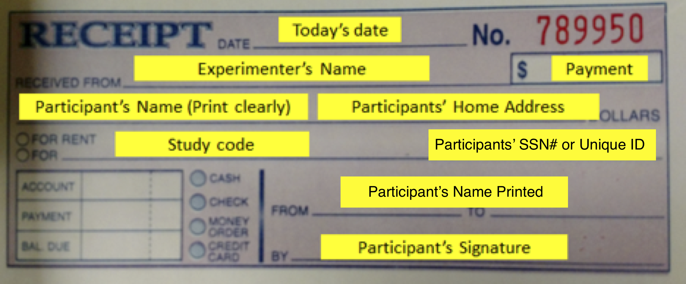

# A walk-through for running fMRI studies at BIAC with the Egner lab

### Becoming eligible to run fMRI studies

1. You'll need to get added to the appropriate medical school IRB protocol. To get added, first sign into iris.duke.edu, which will enter you into the IRB system. The lab manager will then be able to request you getting added to the protocol. To even be eligible for getting added to the IRB, you must complete:

    1. the [CITI training programs](https://www.citiprogram.org/Default.asp). You’ll have to register for an account (one of the first questions that you will be asked is which program you are affiliated with, just choose Duke Health for that), and once you register for Duke Health, it should specify which modules you need to complete.
    2. [these](https://irb.duhs.duke.edu/node/4080) additional tasks if you are an undergraduate
2. If you're running participants, you'll need to get Duke card access so that you can enter the scanning area (and if your Duke card doesn't already have an HID magnet in it, let the lab manager know that you need a new Duke card with one; the magnet is because the fMRI area requires a magnetic tapping of your Duke card rather than scanning of it like, say, most vendors on campus). To get card access:
    1. Complete [the safety quiz](http://www.biac.duke.edu/research/safety/quiz/), which is based on [this tutorial](http://www.biac.duke.edu/research/safety/tutorial.asp) and [this video](http://www.biac.duke.edu/research/safety/safety.asx)
    2. Reach out to Marissa Bruce (marissa.bruce@duke.edu) and let her know you'd like to either meet with her one-on-one or attend a New User Orientation. When you meet with her or attend, bring a completed [screening form](https://www.biac.duke.edu/library/forms/MR_Screening_Form.pdf) and an [SOP acknowledgment form](https://www.biac.duke.edu/library/forms/BIAC_Level_1_MRI_Access_Signature_Sheet.pdf), which requires you to read the [12 SOP's](https://www.biac.duke.edu/research/sop/). For some reason you can't access these PDF's until you already have BIAC access, so just ask someone in lab with BIAC access to open the SOP urls for you.
    3. The lab manager will send an email to biac-help@duke.edu cc'ing you, Tobias, and Marissa Bruce to set up. It will say: <br><br>
```
        To whom this may concern,

        I'm the lab manager in Dr. Tobias Egner's lab, and I’d like to apply for DHE and BIAC access on behalf of a postdoc/(under)graduate student in our lab, XX. (S)he has already attended a new user orientation(or met with Marissa), where they dropped off their MRI screening form and SOP signed agreement.

        When you get a spare moment, could you help set up their DHE and BIAC accounts and then grant them scanner access as well as access to Davison? Below is their information, but as always let me know if you need anything additional.

        Also, Tobias will reply-all to this email granting permission to set up their BIAC accounts and scanner access for the next year.

        First name (and preferred first name):
        Last name:
        Duke NetID:
        Duke UniqueID:
        DukeCard#:
        DukeCard HID#:
        Institution: Duke
        Department: CCN
        Position:
        Current email address:
        Renewal period: 12 months
        BIAC Sponsor: Dr. Tobias Egner
        BIAC Sponsor email: tobias.egner@duke.edu
```

### Setting up a study
1. It's sort of more of a formality, at least compared top the arduous process of getting a medical school IRB approved (don't worry, the lab manager takes care of that), but you still have to get the specific paradigm you're going to be running approved by  BIAC before you can run anyone. Sharena Ballard, BIAC program coordinator, will send an email notifying you of the monthly, upcoming BIAC Scientific Review Committee, which is when your protocol (new and renewals) would get reviewed. This meeting occurs during the first week (usually a Monday) of each month. The proposal form is  [here](http://www.biac.duke.edu/library/forms/BIAC_Proposal_Template.doc) and renewal form [here](http://www.biac.duke.edu/library/forms/BIAC_Renewal_Template.doc), and previously submitted protocols are available on the lab server for reference. Submit the protocol/renewal to research@biac.duke.edu a week before BIAC's review meeting. A couple other details, quoting from one of Sharena's emails:
    1. When submitting, include "The required form, IRB notification of approval (if not already submitted), and copies of the current consent forms."
    2. "If you are submitting a new protocol or your fund code has changed, please be sure to send the fund code/cost object that will fund the study to billing@biac.duke.edu" (you can ask Tobias for this)
2. When your task is ready for the scanner, run a user test (referred to on the online booking schedule as UserTest.01) to make sure the task actually runs in the scanner like you'd hope it would. You can even schedule it less than 24 hours in advance, though if another, paid study schedules for that time that study supersedes the user test. Oh, and the user test is free, which is nice.
3. Create a study folder with a beige manilla folder from the bottom-right cabinet in the lab hall. You'll want the folder to include a [log](fmri_forms/EnrollmentLog.csv) of the participants you run and the following forms (as well as any study-specific surveys/additional paperwork):
    1. [Demographic form](fmri_forms/demographicform.pdf)
    2. [Screening form](fmri_forms/MRI_Screening_Form.pdf)
    3. Latest fMRI consent form (ask lab manager)
    4. [Edinburgh Handedness Inventory](fmri_forms/Edinburgh_Handedness_Inventory.pdf)

### Preparing to run participants
1. Participants often park at the [parking garage](https://map.concept3d.com?id=21&mrkIid=260305#!m/260305) across the street from the Children's Hospital. We compensate participants for the parking with parking passes that we stash in the top drawer of one of the cabinets in our lab hallway. To request more parking permits follow [these instructions](https://parking.duke.edu/parking/permits/department-permits/departmental-visitors).
2. Tell the lab manager that you're running participants so that (s)he knows to go to the cashier's office to pay participants (you can ask Tobias about an appropriate rate to pay participants). Just let the lab manager know how much money you'll need and what the bill breakdown will be. The lab manager has to return any leftover money to the cashier's office every month, so only ask for the amount that you'll need for the next month.
3. Ask volunteer@biac.duke.edu to advertise your study. You'll provide them with a list of dates and times you're free and which scanner you'd like to use, and they'll add any sign up to the BIAC scanner's corresponding online calendar (you'll receive an automatic email for every new sign up). The first time you correspond, you'll also need to send them this [completed form](https://wiki.biac.duke.edu/_media/biac:mri_study_recruitment_request_1_.docx).
### For each participant you run
1. As soon as you receive sign-up confirmation, check [this list](http://www.biac.duke.edu/forums/topic.asp?TOPIC_ID=1007) of technicians' availability and see whether only one or more than one tech is operating at that time. If only one, you have to manually create what is called a NULL.01, which prevents someone from scheduling a scan in the other scanner at the same time (only one study can be run if there's only one tech on duty). You just manually create a new event in the other scanner's BIAC calendar called 'NULL.01'. If there's two techs on duty during most of the session, the NULL.01 should only last however long there is only one tech around.
2. Email participant in advance as a reminder for the study. If they are a last-minute sign up send this email at least 24 hours in advance, but if they sign up, say, a week or more in advance, it may be worth sending the reminder 2-4 days in advance. Ask them about whether they have glasses and if they know their prescription. Here’s a mock email:
```
    Hi [insert name],

    Just a reminder to come in for the fMRI study with BIAC tomorrow at [insert time] [a./p.m.] I’ll be running the study, and if you wouldn’t mind, it would be much appreciated if you could send me your phone number just so I can to reach out if you’re running late. The following only applies to females, but if you are female you’ll be asked tomorrow to provide a urine sample for a pregnancy test- so it’s highly recommended you drink some water before the study. Let me know if you have any questions, and thanks for your interest in the study!

    Best,
    [insert your name]
```
3. Bring the following to the study:
    1. Your Duke card (to get into BIAC)
    2. Money for the participant, including a little extra in case the study runs over (we pay participants at a half-an-hour rate)
    3. Receipt book
    4. Parking passes- Each parking pass only lasts an hour, so bring enough parking passes to last the duration of the study.
    5. [Demographic form](fmri_forms/Demographic_questionnaire.pdf)
    6. [Screening form](https://www.biac.duke.edu/library/forms/MR_Screening_Form.pdf)
    7. Latest fMRI consent form (ask lab manager)
    8. [Edinburgh Handedness Inventory](fmri_forms/Edinburgh_Handedness_Inventory.pdf)
    9. [Enrollment log](fmri_forms/EnrollmentLog.csv)
    10. [TMS screening form](fmri_forms/TMS_Screening_Form.pdf)
    11. Any study-specific surveys/additional paperwork
    12. Don't bring the study folder, though. That folder, containing the paperwork for completed participants, should reside in the locked filing cabinet
4. Meet the participant in the [Children's Hospital lobby](https://map.concept3d.com/?id=21#!m/6830) 15 minutes in advance. When the participant arrives, go from the lobby to [BIAC](https://map.concept3d.com/?id=21#!m/3899):
    1. If you’re facing the aquarium/elevators and your back is to the outside of the hospital- at like 2 o’clock you should see hockey imagery on the wall; this is called [Hurricane Alley](http://www.jimbrownillustration.com/images/hurricanes%20goal%20lower%20res.jpg); it is the beginning of a hallway, and you should walk along this hallway until the hallway ends
    2. When the hallway ends, there should be what appears to be a cinema room on your left; make a left and keep walking until this second hall ends; then make another left and walk all the way to the end of this third hall until you see a pair of doors labeled 'MRI.' Basically you have just walked in a ‘U’ from the lobby to the MRI area
    3. Enter the doors labeled 'MRI' (this requires card/tap access) and go through another set of swinging doors that will also require card/tap access
5. If the participant is male, skip to the next step
    1. If the participant is female, they will have to take a pregnancy test; ask them if they would like to go to the bathroom to take the pregnancy test either at this point, or they can also take the test after the practice session (it’s preferable they wait so they have gone to the bathroom just before getting in the MRI, and therefore don’t have to go to the bathroom during the study).
    2. Go to the MRI room, grab blue cooler to the left of the metal detector, fill it with a pregnancy cup, then leave it in the same spot after the test is done and tell the tech that you're done
6. Go to the scheduled testing room, where the participant will fill out the paperwork and, depending on the study, go through practice trials. If you think you are running behind schedule (the participant was late, or they went to the bathroom/took the pregnancy test), you can save time by only filling out certain paperwork at the time. The only forms the participant must fill before the study are the consent and screening forms.
    1. For the consent form- have subjects write their name and D.O.B. in the white square at the top of every page and be sure to sign the final page.
    2. For the TMS Screening Questionnaire- Make sure that subjects fill out both the front and back of this form! A lot of researchers fail to ensure this, which compromises our lab’s ability to update our TMS Subject Database so please check for this!
7. Ask participant to put all their belongings and anything metal in a locker that is located in the mini-hallway on the left from when you walked through the second pair of swinging doors.
8. If they didn’t do the pregnancy test before, now is the time to do so. See above instructions.
9. Try to get to the scanner a few minutes early, and if a previous study is still using the fMRI just wait outside the fMRI door/let them know you’re there for the next study.
10. Inside the MRI room:
    1. Present the screening form to the tech (they'll give it back to you shortly thereafter)
    2. When females participate we get a sheet with their pregnancy results, and we keep that sheet
11. During the study:
    1. Fill out the behavioral log, noting behavioral trends like accuracy, tardiness, going to the bathroom, and moving a lot (can see if they’re moving a lot by looking at bar near bottom left of tech’s screen- if it’s green means they’re not moving a lot) or any other behavioral trends
    2. Go through paperwork and make sure it's filled out properly—that includes:
        1. name and D.O.B. on top right corner of every page of consent form.
        2. 'Protocol' on top of page: that’s the name of your study, e.g. 'decodCC.01'
        3. Exam Number: ask tech (it's also on the top right of the tech's screen next to the time remaining)
    3. If participant is not doing well suddenly (in terms of accuracy), go to tech and point out they might be falling asleep, might want to talk to the participant
    4. When done with a run, wait until the timer on the tech’s screen hits 0:00 (that’s when the sound on the scanner stops); then prepare next run, enter participant number plus run number, select ok, then give keyboard back to tech and tell them to hit spacebar when ready
12. It's possible the tech will have to cut your study early if it's not up after an hour. Ultimately, it's up to the tech as frustrating as that can be. If you feel gipped, either because the tech wasn't ready to start on time, the session ended too early, both, or there was a technical issue with the scanner itself, you can record it in the study details of that scanning session on the BIAC calendar. BIAC's billing will see the notes and review/discuss it before charging Tobias.
13. After the scan (outside of the MRI room, since you don't want to hold up the next study):
    1. If you were running behind and had to skip it before the scanner, ensure participants complete all the necessary paperwork
    2. Pay participants and have them fill out the receipt according to the following:
    
    3. Add participants' completed forms to the study folder in the locked file cabinet
    4. If participants answered no to every question on the TMS screening form, add their data to the TMS database for [Protocol 00024349](https://duke.app.box.com/file/312430529909) or [Protocol 00101414](https://duke.app.box.com/file/548293745548), depending on whether the fMRI study was run under the old (pre-2019) or new (2019-onwards) R01 grant, respectively (the passwords to those Excel sheets can be found on the server); we enter this information since TMS studies require having the participants' anatomical scan, and in the process of running an fMRI study we acquire an anatomical MRI
